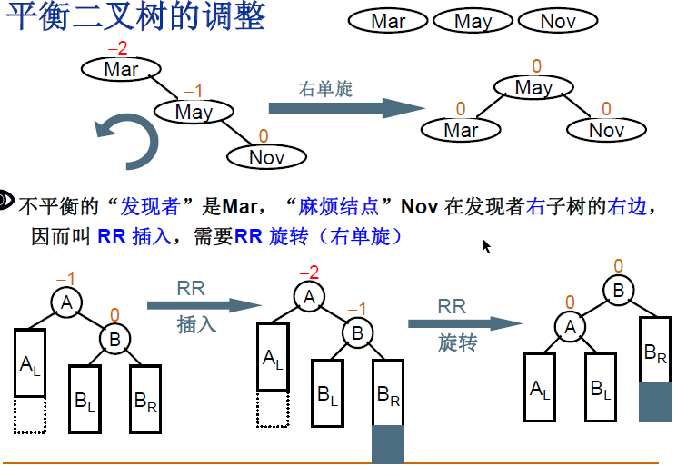
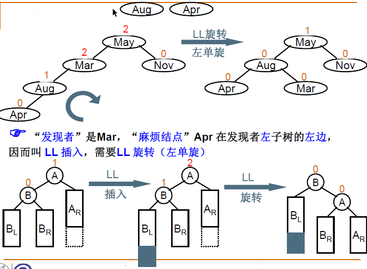
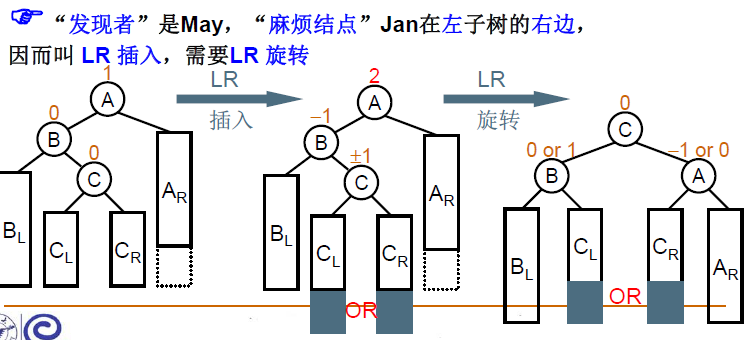
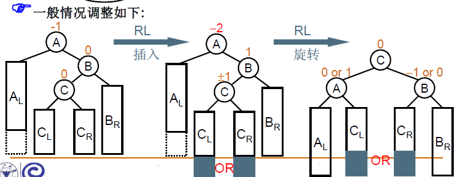

## 平衡二叉树

### 定义

- 平衡因子

  BF(T) = hL-hR，其中hL和hR分别为T的左、右子树的高度。

- 平衡二叉树:（AVL树）空树，或者任一结点左、右子树高度差的绝对值不超过1，即|BF(T) |≤ 1

### 平衡二叉树的4种调整
- 每次都是以平衡因子为1的结点为中心进行旋转

  - RR旋转

  

  - LL旋转

  

  - LR旋转

  

  - RL旋转

  
