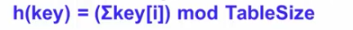
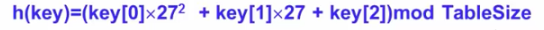
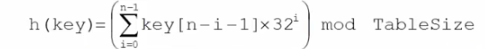
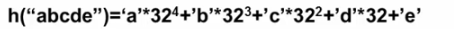
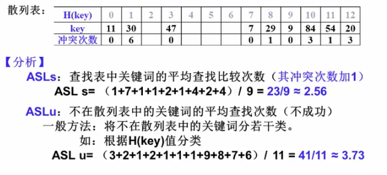

## 散列查找法
### 基本思想
- 给数据分配地址：以关键字key为自变量，通过一个确定的函数h（散列函数），计算出对应的函数值h（key），作为数据对象的存储地址。

- 解决冲突：可能不同的关键字会映射到同一个散列地址上。
    即h(keyi)=h(keyj)(当keyi != keyj)，称为“冲突”。
    ---需要某种冲突解决策略。

### 性能分析
- 优点
  - 散列表的查找效率为常数O（1），几乎与关键字的空间大小n无关，适合于关键字直接比较计算量比较大的问题。
  - 适合处理字符串的查找存储。基本方法：将字符串通过散列函数转换为数字，从而进行查找存储。

- 缺点
  - 散列方法的存储对关键字是随机的，不便于顺序查找关键字，也不适合范围查找，或最值查找。
### 散列函数设计方法
- 一个好的散列函数一半考虑下列两个因素：

    1.计算简单，以便提高转换速度

    2.关键词对应的地址空间分布均匀，以尽量减少冲突

### 数字关键字的散列函数构造
- 直接定址法：取关键词的某个线性函数值为散列地址.
h(key)=a*key+b    (a，b为常数)

- 除留余数法：散列函数为h(key)=key mod p
这里 p=tablesize；一般p取素数。

- 数字分析法：分析数字关键字在各位上的变化情况，取比较随机的位作为散列地址

  比如：取11位手机号码key的后四位作为地址
散列函数为：h(key)=atoi(key+7)    （k为char型指针）
刚开始key指向第一位，此时key指向第八位。

- 折叠法：把关键词分割成位数相同的几部分，然后叠加

               如：56793542
                          542
                          793
                         +056
                         ——————          h(56793542)=391
                         1391

- 平方取中法：让结果能够被更多的位数影响，折叠法也是。
            如：56793542

                    567935
                   乘以567935
                   ————
             3225506412905764
                        ——

### 字符关键字的散列函数构造
-  一个简单的散列函数——ASCII码加和法（操作的是字符串，每一个key[i]就是一个字符串）
    对字符型关键字key定义散列函数如下：

- 简单的改进——前3个字符移位法

- 好的散列函数——移位法
    涉及关键词所有n个字符，并且分布的很好。
    
  如：
  

### 散列处理冲突的方法

#### 常用处理冲突的思路：
- 换个位置: 开放地址法
- 同一位置的冲突对象组织在一起: 链地址法

### 开放地址法
- 定义：一旦产生了冲突（该地址已有其它元素），就按某 种规则去寻找另一空地址

- 基本操作：
若发生了第 i 次冲突，试探的下一个地址将增加di，基本公式是：
hi(key) = (h(key)+di) mod TableSize ( 1≤ i < TableSize ）

  di 决定了不同的解决冲突方案：线性探测（di = i）、平方探测（di = ± i2）、双散列（di = i*h2(key)）。

### 线性探测法
- 定义：以增量序列1,2，3......(Table Size-1),依次循环试探下一个存储地址。
- 散列表查找性能分析：
  - 成功平均查找长度（ASLs）
  - 不成功平均查找长度（ASLu）
  
  -   ASLu 就是看第一个空位出现的位置，如果后面第一个空位确定没有，就能确定该表中不存在该键。

### 平方探测法
- 定义：以增量序列（+-）$i^2$，且q<=(TableSize/2)循环试探下一个存储地址。
- 以第一次的结果为原点，分别左右探测。
- 有定理显示：如果散列表长度Tablesize是某个4k+3(k是正整数)形式的素数时，平方探测法就可以探查到整个散列表空间。
- 平方探测和线性探测的区别：
  线性探测聚集度较高；平方探测不容易找到空间。

### 双散列探测法
- 定义：di（偏移量）为i*h2（key），h2（key）是另一个散列函数：h2（key），2h2（key），3h2（key）...
- 探测序列还用改保证所有的散列存储单元都应该能够被探测到。一般为选择以下形式：
  h2（key）=p-(key mod p)  (其中p<Tablesize,p.Tablesize都是素数)

### 再散列
- 当散列表元素太多（装填因子太大时），查找效率会下降。
- 实用最大填装因子一般取0.5<= a <=0.85
- 当装填因子过大时，解决方法：加倍扩大散列表，原有的元素重新分配。该过程为“再散列”。

### 分离链接法
- 定义：将相应位置上冲突的所有关键词存储在同一个链表中。
- 头结点为顺序表，后面有冲突的结点被封装成一个链表。
